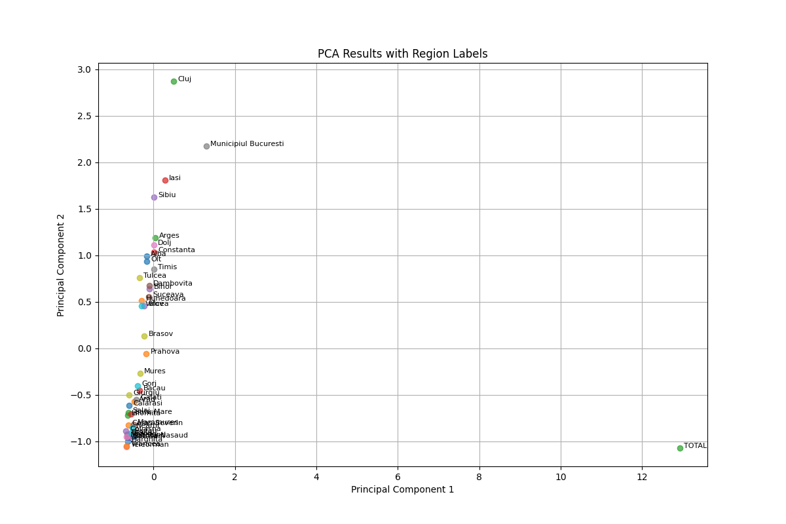
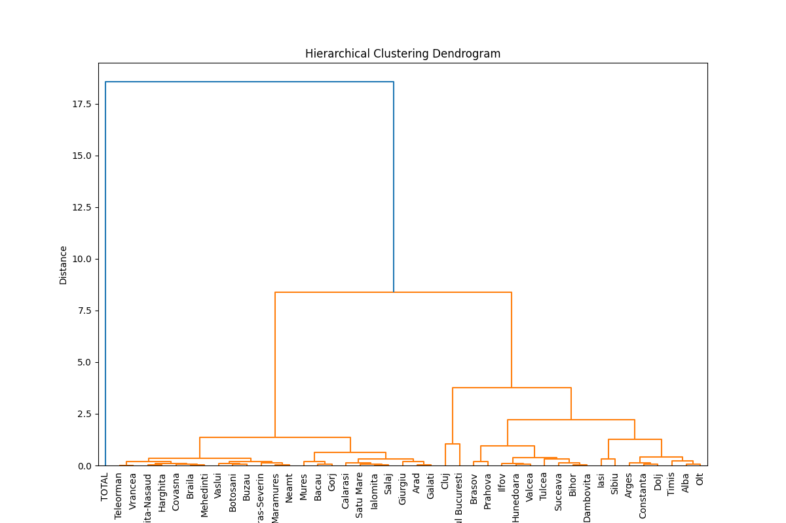

# Employment Data Analysis Project

## Overview
This project analyzes employment-related data using **Principal Component Analysis (PCA)** and **Hierarchical Cluster Analysis (HCA)**. The project leverages Python for data preprocessing, analysis, and visualization. The results provide insights into socio-economic factors influencing employment across various regions.

---

## Features
1. **Principal Component Analysis (PCA)**:
   - Reduces the dimensionality of the dataset to identify patterns and key variables.
   - Visualizes results as a scatter plot with region labels.

2. **Hierarchical Cluster Analysis (HCA)**:
   - Groups regions into clusters based on PCA-transformed data.
   - Displays results using a dendrogram.

3. **Data Pipeline**:
   - Handles missing data using imputation.
   - Standardizes numerical variables for analysis.

---

## Requirements
### Python Packages
- `pandas`
- `numpy`
- `matplotlib`
- `scikit-learn`
- `scipy`

To install the dependencies, run:
```bash
pip install -r requirements.txt
```

---

## Folder Structure
```
project/
│
├── dataIN/
│   └── employment_dataset_raw.xlsx  # Input dataset
│
├── dataOUT/
│   ├── PCA_results.csv              # PCA output file
│   ├── PCA_Scatter_Plot.png         # PCA visualization
│   └── HCA_Dendrogram.png           # HCA dendrogram
│
├── pca_analysis.py                  # PCA script
├── hca_analysis.py                  # HCA script
└── README.md                        # Project documentation
```

---

## Usage

### 1. Prepare Input Data
Place the file `employment_dataset_raw.xlsx` in the `dataIN` folder. The input dataset must contain the following columns:
- Macroregiuni, regiuni de dezvoltare si judete
- Accidente colective de munca (dummy variable)
- Biblioteci
- Castigul salarial nominal mediu net lunar
- Numarul mediu al salariatilor
- Resurse de munca
- Unitatile de invatamant

### 2. Run PCA Analysis
Execute the PCA script to analyze the dataset and visualize the results:
```bash
python pca_analysis.py
```
Outputs:
- `PCA_results.csv` (saved in `dataOUT`)
- `PCA_Scatter_Plot.png` (saved in `dataOUT`)

### 3. Run HCA Analysis
Execute the HCA script to perform clustering on PCA results:
```bash
python hca_analysis.py
```
Outputs:
- `HCA_Dendrogram.png` (saved in `dataOUT`)

---

## Example Outputs

### PCA Scatter Plot


### HCA Dendrogram


---

## Results
- The PCA scatter plot highlights key patterns and regions based on employment-related factors.
- The HCA dendrogram groups regions into clusters, providing insights into regional similarities and differences.

---

## Authors
This project was developed as part of a team data analysis assignment.

